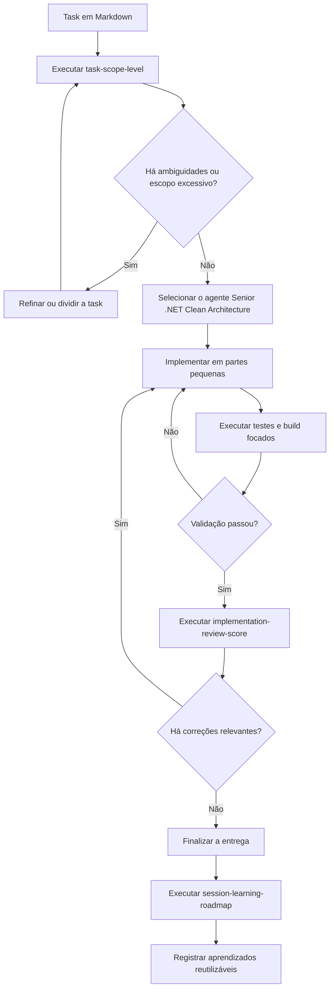

# Guia de uso das customizações do Copilot

Este diretório concentra customizações versionadas para uso do GitHub Copilot neste workspace: skills, agentes, workflows e documentação de apoio.

## Estrutura

| Caminho | Conteúdo | Uso |
| --- | --- | --- |
| `.github/skills/` | Skills invocáveis por `/nome-da-skill`. | Fluxos específicos, repetíveis e com contrato de saída. |
| `.github/agents/` | Agentes especializados. | Contexto técnico persistente para tarefas de uma área. |
| `.github/copilot-customizations/README.md` | Fluxo detalhado das customizações atuais. | Referência rápida para uso das skills e do agente .NET. |
| `.github/workflows/` | GitHub Actions. | Automação do repositório. |

## Customizações disponíveis

| Customização | Tipo | Quando usar | Resultado esperado |
| --- | --- | --- | --- |
| `/task-scope-level` | Skill | Antes da implementação, para classificar a abrangência de uma task Markdown. | Relatório `.md` com nível, nota, fatores de escopo e ambiguidades. |
| `Senior .NET Clean Architecture` | Agente | Durante implementação, revisão, refatoração ou debug C#/.NET. | Código ou análise orientada por SOLID, Clean Architecture e validação focada. |
| `/implementation-review-score` | Skill | Depois da implementação, para revisar o diff contra uma task Markdown. | Relatório `.md` com nota, evidências, achados, patches sugeridos e esforço de correção. |
| `/session-learning-roadmap` | Skill | Ao fechar uma sessão relevante do Copilot. | Roadmap `.md` com aprendizados, decisões, dificuldades e exercícios práticos. |

## Fluxo recomendado



### 1. Antes de implementar

Use `/task-scope-level` para medir a abrangência real da task e expor ambiguidades antes de escrever código:

```text
/task-scope-level docs/tasks/task-exemplo.md docs/reviews/task-exemplo-scope.md
```

Use o relatório para decidir se a task está pequena o bastante, se há critérios transferidos para outra tarefa e quais perguntas precisam ser respondidas antes da implementação.

### 2. Durante a implementação

Use o agente `Senior .NET Clean Architecture` para tarefas C#/.NET que envolvam domínio, casos de uso, APIs, persistência, testes, arquitetura ou refatoração.

Prompt base:

```text
Use o agente Senior .NET Clean Architecture.
Implemente a task docs/tasks/task-exemplo.md.
Preserve contratos públicos, siga os padrões existentes e valide com o menor teste/build focado possível.
```

Informe comportamento esperado, restrições, arquivos relevantes e validações desejadas. O agente deve decompor a tarefa, preservar fronteiras arquiteturais, evitar abstrações especulativas e validar após a primeira alteração substantiva.

### 3. Depois da implementação

Use `/implementation-review-score` para auditar o que foi entregue contra a task:

```text
/implementation-review-score docs/tasks/task-exemplo.md main docs/reviews/task-exemplo-implementation-review.md
```

Passe `main` explicitamente como base neste repositório. A skill usa `master` quando a base é omitida.

### 4. Depois de uma sessão importante

Use `/session-learning-roadmap` para transformar o histórico da sessão em aprendizado reutilizável:

```text
/session-learning-roadmap sessao atual docs/learning-roadmaps/YYYY-MM-DD-task-exemplo.md
```

Essa skill depende do histórico local indexado do Copilot. Se o índice não estiver disponível, o correto é bloquear e informar a limitação.

## Sequência curta

```text
/task-scope-level <task.md> <scope-review.md>
```

```text
Use o agente Senior .NET Clean Architecture para implementar <task.md>.
```

```text
/implementation-review-score <task.md> main <implementation-review.md>
```

```text
/session-learning-roadmap sessao atual <learning-roadmap.md>
```

## Ideias de novas skills

| Ideia | Tipo | Objetivo | Prioridade sugerida |
| --- | --- | --- | --- |
| `acceptance-criteria-matrix` | Skill | Ler uma task Markdown e gerar matriz de critérios, casos felizes, erros e evidências esperadas. | Alta |
| `dotnet-test-plan` | Skill | Criar plano de testes xUnit por camada, incluindo casos de domínio, aplicação, infraestrutura e API. | Alta |
| `clean-architecture-boundary-review` | Skill | Auditar referências entre projetos .NET e apontar violações de dependência entre camadas. | Alta |
| `api-contract-review` | Skill | Revisar DTOs, status HTTP, validação, compatibilidade e contratos de erro de endpoints. | Média |
| `ef-core-query-review` | Skill | Avaliar consultas EF Core para N+1, tracking desnecessário, paginação, índices e materialização prematura. | Média |
| `security-threat-model` | Skill | Gerar análise de ameaças por fluxo: entrada, autenticação, autorização, dados sensíveis e logs. | Média |
| `bug-reproduction-report` | Skill | Transformar um bug em passos de reprodução, hipótese, evidência, teste de regressão e correção mínima. | Alta |
| `adr-generator` | Skill | Criar Architecture Decision Records com contexto, decisão, alternativas, trade-offs e gatilhos de revisão. | Média |
| `release-readiness-check` | Skill | Checar build, testes, migrações, feature flags, observabilidade, rollback e documentação antes do merge. | Média |
| `session-daily-log` | Skill | Gerar diário técnico diário com base nas sessões do Copilot, commits e arquivos alterados. | Baixa |

## Ideias de novos agentes

| Ideia | Objetivo |
| --- | --- |
| `Senior Vue TypeScript` | Implementar e revisar front-ends Vue/TypeScript com foco em composição, estado, validação, acessibilidade e testes. |
| `QA Test Architect` | Projetar cenários de teste, regressão, pirâmide de testes e validações automatizadas por risco. |
| `DevOps Release Engineer` | Revisar CI/CD, Docker, variáveis, deploy, observabilidade, rollback e readiness de release. |
| `Security Reviewer` | Revisar autenticação, autorização, exposição de dados, logs, segredos, validação de entrada e dependências. |
| `Database Performance Reviewer` | Avaliar queries, índices, migrações, concorrência, locks e consistência de dados. |

## Ideias de prompts e instruções

| Ideia | Melhor formato | Objetivo |
| --- | --- | --- |
| Checklist de PR | Prompt | Gerar descrição de PR com resumo, risco, testes, screenshots e rollback. |
| Template de issue técnica | Prompt | Transformar contexto solto em issue com problema, impacto, proposta, critérios e validação. |
| Convenções gerais do repo | `copilot-instructions.md` | Registrar padrões sempre válidos para este repositório. |
| Instruções para tasks Markdown | `.instructions.md` | Aplicar regras específicas quando editar arquivos de task ou documentação de requisitos. |
| Instruções para C# | `.instructions.md` | Aplicar regras específicas para `**/*.cs`, como evitar `var`, respeitar nulabilidade e propagar `CancellationToken`. |

## Critérios para criar uma nova customização

- Use uma skill quando o fluxo tiver várias etapas, evidências, validações e um arquivo de saída.
- Use um agente quando a tarefa exigir uma postura técnica especializada durante implementação ou revisão.
- Use um prompt quando a tarefa for curta, parametrizada e produzir uma saída única.
- Use instruções quando a regra deve estar presente de forma recorrente para um tipo de arquivo ou projeto.
- Evite duplicar regras entre skills, agentes e instruções; escolha o menor escopo que resolve o problema.

## Manutenção

- Mantenha o `description` do frontmatter claro, porque ele é a principal superfície de descoberta do Copilot.
- Prefira nomes em kebab-case para skills e prompts.
- Valide que cada skill tem `SKILL.md` dentro de `.github/skills/<nome>/`.
- Valide que cada agente termina com `.agent.md` dentro de `.github/agents/`.
- Atualize este README quando adicionar, remover ou renomear customizações.