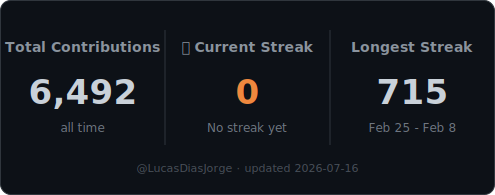

# Lucas Dias Jorge

**Full-Stack Developer · .NET · Vue.js**

Building reliable, scalable, and secure applications — from the database to the browser. 
Clean architecture and robust APIs on the back end, reactive and type-safe interfaces on the front end.

---

## 👋 About me

Full-stack developer focused on the **.NET ecosystem** and modern **TypeScript/Vue**. I design robust, well-tested APIs following clean architecture and pair them with reactive, type-safe front ends. I care about maintainable code, solid testing, observability, and shipping to production with confidence.

- 🧱 Back-end first, full-stack by choice — I own features end to end, from data model to UI.
- 🧪 Test-driven mindset with a focus on clean, evolvable design.
- 🚀 From API design to production deployment.

---

## 🔧 Tech Stack

**Back-End** 

**Front-End** 

**Databases** 

**Auth & Security** 

**Testing & Quality** 

**Architecture & Design** 

**Observability & DevOps** 

---

## 📊 Stats

  

  Streak card is self-hosted — generated daily by a <a href="./.github/workflows/update-streak.yml">GitHub Action</a> from the GraphQL contributions API, no third-party service involved.

---

## 📫 Get in Touch

I'm always open to interesting projects and conversations.

- 💼 [LinkedIn](https://www.linkedin.com/in/lucasdiasjorge)
- ✉️ [lucas_jorg@hotmail.com](mailto:lucas_jorg@hotmail.com)
