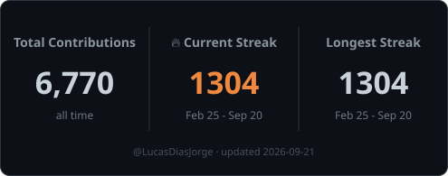

# Lucas Dias Jorge

**Full-Stack Developer · .NET · Vue** — and a C lang enjoyer at heart.

Building reliable, scalable, and secure applications — from the database to the browser, 
and from the socket up when the problem asks for it.

## 👋 About me

Full-stack developer focused on the **.NET ecosystem** and modern **TypeScript/Vue**. I design robust, well-tested APIs following clean architecture and pair them with reactive, type-safe front ends.

Off the clock, most of my repositories are systems code: **C, C++ and Rust** — data structures, concurrency, shared memory, and protocol work. That habit is what keeps the high-level design honest: I like knowing what the abstraction actually costs.

- 🧱 Back-end first, full-stack by choice — I own features end to end, from data model to UI.
- 🧪 Test-driven mindset, clean architecture, evolvable design.
- 🔬 Distributed systems and low-level programming as a standing side quest.

## 🚀 Featured projects

| Project | Stack | What it is |
| --- | --- | --- |
| [Blockchain-gRPC](https://github.com/LucasDiasJorge/Blockchain-GRPC) | Rust · gRPC | Blockchain core with clean architecture, multi-graph state, durable persistence and a well-defined gRPC pipeline. |
| [Microservices](https://github.com/LucasDiasJorge/Microservices) | Java · Spring Cloud | Service mesh with Eureka discovery, API gateway, OAuth2 authorization and resource services. |
| [Orchestrator](https://github.com/LucasDiasJorge/Orchestrator) | C# · .NET | Saga orchestrator for distributed order processing. |
| [Shared-Memory-Observer](https://github.com/LucasDiasJorge/Shared-Memory-Observer) | C++ | Observer pattern implemented across processes over shared memory. |
| [Impinj-Octane-Implementation](https://github.com/LucasDiasJorge/Impinj-Octane-Implementation) | C# · RFID | Impinj Octane SDK integrations for multiple real-world solutions. |
| [C-Codebase](https://github.com/LucasDiasJorge/C-Codebase) | C | Long-running playground: data structures, memory and systems experiments. |

## 🔧 Tech stack

| | |
| --- | --- |
| **Back-end** | C# · ASP.NET Core · EF Core · Dapper · gRPC · REST · Background Workers · Java/Spring |
| **Front-end** | TypeScript · Vue 3 · Pinia · TanStack Query · Zod · Vuetify |
| **Systems** | C · C++ · Rust · threads & concurrency · shared memory · sockets |
| **Data** | SQL Server · PostgreSQL · MySQL · MongoDB · Redis |
| **Architecture** | Clean Architecture · DDD · SOLID · Microservices · Design Patterns |
| **Quality & Ops** | xUnit · TDD · Docker · GitHub Actions · structured logging · caching · secret management |

## 🌱 Currently

- Exploring **embeddings and LLM tooling in C#** ([Embeddings-CSharp](https://github.com/LucasDiasJorge/Embeddings-CSharp), [Token-Analyzer](https://github.com/LucasDiasJorge/Token-Analyzer)).
- Growing the Rust side — a [Redis-like server](https://github.com/LucasDiasJorge/Rustdis) and the blockchain node above.
- Keeping the fundamentals sharp with [daily algorithm practice](https://github.com/LucasDiasJorge/Daily-leetcode).

## 📊 Stats

  

  Streak card is self-hosted — generated daily by a <a href="./.github/workflows/update-streak.yml">GitHub Action</a> from the GraphQL contributions API, no third-party service involved.

