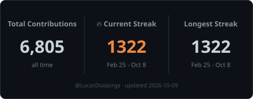

# Lucas Dias Jorge

**Backend-focused Full-Stack Developer · .NET & Java/Spring · Vue · IoT/RFID · C/C++/Rust**.

Building APIs, integrations, and device-facing software — from web interfaces to embedded protocols.

  

  Streak card is self-hosted — generated daily by a <a href="./.github/workflows/update-streak.yml">GitHub Action</a> from the GraphQL contributions API, no third-party service involved.

## 👋 About me

Full-stack developer with a backend-first focus. My projects span **C#/.NET and Java/Spring APIs**, **TypeScript/JavaScript interfaces with Vue**, and distributed services built around Kafka, REST/gRPC, and JWT/Keycloak authentication.

I also work close to hardware and protocols: **RFID reader integrations**, ESP32/ESP8266, MQTT, LoRa, Modbus, and low-level/concurrent programming in **C, C++ and Rust**. Other project areas include data processing, computer vision, and mobile/desktop apps with Flutter, Android, and Qt.

- 🧱 Backend-first, full-stack by choice — I take features from domain/API design through persistence, integrations, and UI.
- 🔌 I enjoy connecting software with hardware and external systems: reader workflows, event messaging, sockets, and embedded protocols.
- 🧪 I value maintainable architecture and testing, and use Docker, Linux, and deployment automation to run projects reliably.

## 🔧 Tech stack

| | |
| --- | --- |
| **Back-end & APIs** | C# · ASP.NET Core · EF Core · Dapper · Java · Spring Boot/Cloud · Rust/Actix · Node.js · REST · gRPC |
| **Distributed systems** | Microservices · Kafka · JWT/Keycloak · service discovery · background workers · SSE · WebSockets |
| **Front-end** | TypeScript · JavaScript · Vue 3 · Pinia · TanStack Query · Zod · Vuetify |
| **IoT & RFID** | ESP32/ESP8266 · MQTT · LoRa · Modbus · Impinj/R700 readers · EPC processing |
| **Systems & embedded** | C · C++ · Rust · ARM · concurrency · shared memory · sockets |
| **Data & AI** | Python scripting · SQL Server · PostgreSQL · MySQL · MongoDB · Redis · data processing · OpenCV · embeddings |
| **Mobile & desktop** | Flutter · Android · Qt |
| **Architecture & quality** | Clean/Hexagonal Architecture · DDD · SOLID · design patterns · xUnit · TDD |
| **DevOps & operations** | Docker/Compose · Linux · Nginx · GitHub Actions · deployment scripts · structured logging · caching · secret management |
